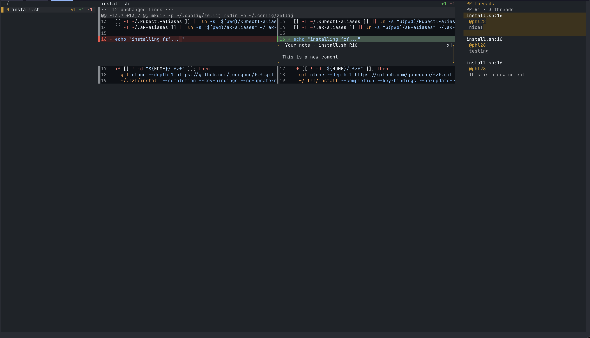
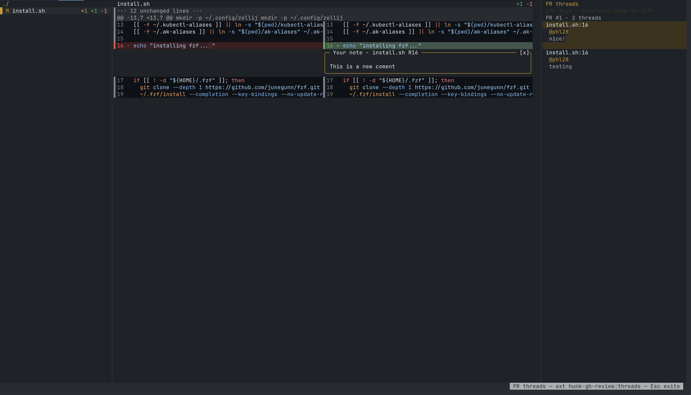
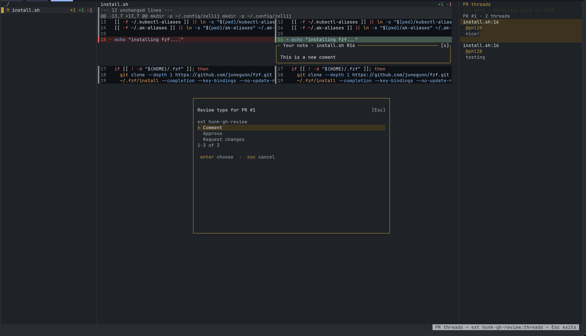

# hunk-gh-review

A [hunk](https://hunk.dev) extension that submits your review notes as a real GitHub PR review — Comment, Approve, or Request changes — without leaving the terminal.



## Install

Requires hunk ≥ 0.19 (the pane and keyboard-mode APIs) and the [`gh`](https://cli.github.com) CLI, authenticated. The manifest declares `apiVersion: 6`, so older hunk versions refuse the install cleanly.

```bash
hunk extension install phl28/hunk-gh-review
```

The install asks for confirmation, so it needs a terminal; pass `--yes` when running it from a script or an agent.

`hunk extension list` shows it once it lands; new hunk sessions pick it up automatically.

## Usage

No lazygit or other tooling needed — just hunk and gh. Three ways in:

```bash
# A. Check the PR out, then review its changes
gh pr checkout 123 && hunk diff origin/main...HEAD

# B. Review uncommitted work on a branch that has an open PR
hunk diff

# C. Checkout-free: pipe the PR diff in, naming the PR so submits target it
gh pr diff 123 | GH_PR_NUMBER=123 GH_PR_REPO=owner/repo hunk patch -
```

A and B resolve the PR automatically from the checked-out branch. C needs the env vars (or a launcher that sets them — see the lazygit example below), because a piped diff carries no PR identity.

Then, inside hunk:
1. Press **`T`** for the **PR threads pane**: every review thread on the PR, docked right. Opening it when threads exist also enters a keyboard mode — `j`/`k` (or arrows) walk the thread list, `g`/`G` jump to the ends, and the diff follows each selection to its exact line; `enter` or `esc` drops back to normal diff keys. Clicking a thread works too. Press **`R`** to reply to the active thread. Threads refetch on reloads, after replies, and after you submit a review.
2. Press `c` on hunks/lines to leave notes as you go.
3. Press **`S`** to submit:
   - resolves the target PR itself — `GH_PR_NUMBER`/`GH_PR_REPO` if the launcher set them, otherwise the checked-out branch's open PR — and asks you to **confirm** it (number + title). The number is never typed by hand: comments can only land on the PR whose diff is under review, since their line positions must match that PR's head diff. A set-but-empty `GH_PR_NUMBER` means the launcher already determined this review has no open PR, so the checked-out branch's PR is *not* used as a fallback (that would target the wrong PR)
   - asks for the review type (Comment / Approve / Request changes) and an optional top-level body
   - posts one atomic GitHub review containing every note as an inline comment (`new`-side notes → `RIGHT`, `old`-side → `LEFT`)
   - clears the submitted notes from the session so a second press doesn't double-post

If there is no PR to attach notes to (e.g. reviewing uncommitted changes on a branch with no open PR), `S` fails with a clear message — GitHub reviews attach to PRs, not branches.

Inline notes are optional, matching the GitHub UI: **Approve** and **Request changes** submit fine with no notes and no body; a **Comment** review with no inline notes requires a top-level body (the body prompt tells you when it's required).

| Leave notes inline (`c`) | Choose the review type (`S`) |
| --- | --- |
|  |  |

**Fork-style clones:** gh resolves its base repo from remotes with the priority `upstream` > `github` > `origin`, so in clones with an `upstream` remote, bare `gh pr view`/`gh repo view` can silently query the wrong repo. Pass `GH_PR_REPO` (the `hpr` launcher derives it from the branch's tracking remote), or fix the clone once with `gh repo set-default owner/repo`.

The whole review is a single GitHub API call: if GitHub rejects any comment position, nothing is posted and the error is shown as a notification.

### Example launcher: lazygit + `hpr`

Optional, but this is how I use it: a small `hpr` script that resolves the PR for a branch (falling back to a plain branch diff when there isn't one), passes the PR identity through as `GH_PR_NUMBER`/`GH_PR_REPO` so `S` targets correctly, and pipes the diff into hunk — wired to a `v` key in [lazygit](https://github.com/jesseduffield/lazygit)'s branches panel:

```yaml
# lazygit config.yml (macOS: ~/Library/Application Support/lazygit/config.yml)
customCommands:
  - key: 'v'
    context: 'localBranches'
    description: 'Review PR in hunk'
    command: 'hpr {{.SelectedLocalBranch.Name | quote}}'
    output: terminal   # suspends lazygit while hunk runs; quitting hunk drops you back
```

If your config already has a `customCommands:` key, add just the list item under it — a second top-level `customCommands:` is a duplicate YAML key, and one of the two blocks is dropped.

The script is [`scripts/hpr`](scripts/hpr) in this repo — drop it on your `PATH`:

```bash
curl -fsSL https://raw.githubusercontent.com/phl28/hunk-gh-review/main/scripts/hpr -o ~/.local/bin/hpr
chmod +x ~/.local/bin/hpr
```

Because the script sets the env vars, `S` submits to the branch under the lazygit cursor — even for a branch you don't have checked out. `hpr` also works on its own from the shell (`hpr 123`, `hpr feature-x`, bare `hpr` for the current branch).

## Notes

- GitHub calls go through `gh`, so auth/scopes are whatever `gh auth status` says.
- The threads pane shows review comments on the diff (`pulls/{N}/comments`). Comments sitting on outdated diff positions (e.g. after a force-push) are hidden, with the count shown in the header. PR *conversation* comments (not attached to code) are not shown.
- `R` replies to the active thread — the one last clicked, or the one under the keyboard-mode cursor. While the mode is active, unhandled keys pass through (so `R`, `c`, `/` etc. keep working) and `esc` exits host-side.
- Notes are read from the live session via `hunk session comment list` (authoritative, sees deletions); the `note_created`/`note_edited` event stream is a fallback for when the session daemon is unreachable.
- Rebind keys in hunk's config: `[keybindings]` with `"gh-review.submit"`, `"gh-review.threads"`, `"gh-review.reply"` mapped to your chords.
- Pane placement is configurable via `[extension.gh-review]` in hunk's config: `placement = "right"` (default), `"left"`, `"top"`, or `"bottom"`.
- Hunk's built-in `e` key (open file in editor) reads `$EDITOR` and fails with "$EDITOR is not set." when there is none. This extension sets it for the session so the key works without a per-shell export: to force one, set `editor` in `[extension.gh-review]` (e.g. `editor = "code"`); otherwise it uses `$EDITOR` if already set, then `$VISUAL`, then git's editor (`GIT_EDITOR` / `core.editor`), then a small built-in list of common editors on `PATH`.
- **Narrow terminals:** hunk responsively omits panes that don't fit — a side pane needs the terminal width minus the review's minimum width to leave at least its `min` columns, and the built-in files sidebar claims its share first. If `T` opens nothing visible, use `placement = "bottom"` (it only needs 5 rows) or widen the terminal.

## Develop

```bash
pnpm install
pnpm run typecheck   # tsc --noEmit against the shipped hunkdiff extension types
```

(`hunkdiff` is a types-only devDependency — the hunk binary that runs the extension is your system install — so its bundled `bun` binary build script is disabled in `pnpm-workspace.yaml`.)

Test a change live: `hunk diff --extension ~/Code/hunk-gh-review` in any dirty repo.

To load the checkout instead of the installed copy in every session, point your user config at it (`~/.config/hunk/config.toml`):

```toml
[extensions]
paths = ["/path/to/hunk-gh-review"]
```

Do **not** symlink the folder into `~/.config/hunk/extensions/` — the auto-scanner silently skips symlinked directories (the `readdir` dirent for a symlink fails `isDirectory()`).

Use one install source or the other — two sources providing the same extension id collide, and the second is skipped with a startup notice.
