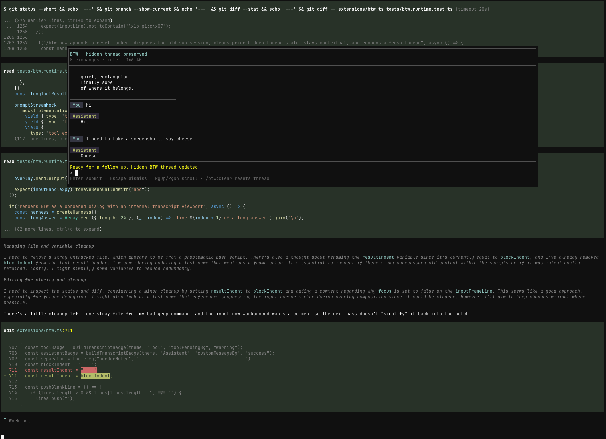

# pi-btw (dotfiles fork)

Local copy of `npm:pi-btw@0.7.1`. **`/btw` and `/side` are a tool-free overlay**: they stream the answer text only (no thinking, tools, or badges). Thinking defaults to off so a short question does not sit in a thinking stream. `/btw:tangent` still has the full coding toolset. `/btw:ask` is the same tool-free thread.

Cursor models use a child-owned `pi-cursor-sdk` binding. The parent Cursor provider is not copied onto the overlay session.

A small [pi](https://github.com/earendil-works/pi-mono) extension that adds a `/btw` side conversation channel.

`/btw` opens a real pi sub-session and it runs immediately even while the main agent is still busy.



## What it does

- opens a parallel side conversation without interrupting the main run
- runs that side conversation as a real pi sub-session; `/btw` is tool-free and the overlay streams the answer
- keeps a continuous BTW thread by default
- accepts `/side` as an alias for the `/btw` entry command
- supports `/btw:tangent` for a contextless side thread that does not inherit the current main-session conversation
- supports `/btw:ask` for the same tool-free overlay as `/btw`
- opens a focused BTW modal shell with its own composer and transcript
- keeps the BTW overlay open while you switch focus back to the main editor with `Alt+/`, `Super+/`, or `Ctrl+Alt+W` (all remappable)
- keeps BTW thread entries out of the main agent's future context
- supports BTW-only model and thinking overrides without changing the main thread settings
- lets you inject the full thread, or a summary of it, back into the main agent
- optionally saves an individual BTW exchange as a visible session note with `--save`

## Install

pi-btw supports Pi 0.85.1 through 1.x.

Development dependencies target Pi 0.99.2. CI runs the tests and typecheck
against the locked dependencies, Pi 0.85.1, and the latest published Pi release
on each PR and weekly. Pi 0.99.2 requires Node.js 22.19.0 or newer.

### From npm (after publish)

```bash
pi install npm:pi-btw
```

### From git

```bash
pi install git:github.com/dbachelder/pi-btw
```

Then reload pi:

```text
/reload
```

### From a local checkout

```bash
pi install /absolute/path/to/pi-btw
```

## Usage

```text
/btw what file defines this route?
/side what file defines this route?
/btw how would you refactor this parser?
/btw --save summarize the last error in one sentence
/btw:new let's start a fresh thread about auth
/btw:tangent brainstorm from first principles without using the current chat context
/btw:ask what does this module do?
/btw:ask --save explain the latest test failure
/btw:model openai gpt-5-mini openai-responses
/btw:thinking low
/btw:inject implement the plan we just discussed
/btw:summarize turn that side thread into a short handoff
/btw:clear
```

## Commands

### `/btw [--save] <question>`

- runs right away
- works while pi is busy
- creates or reuses a real BTW sub-session instead of a one-off completion call
- continues the current BTW thread
- opens or refreshes the focused BTW modal shell
- streams into the BTW modal transcript/status surface
- on RPC/SDK hosts, displays completed inline-question responses as visible session notes instead
- composer-only `/btw` requires the TUI; pass the question inline on RPC/SDK hosts
- persists the BTW exchange as hidden thread state
- with `--save`, also saves that single exchange as a visible session note

### `/side [--save] <question>`

- alias for `/btw`, matching the equivalent command in Codex
- shares the same thread, overlay, persistence, model, and thinking settings as `/btw`
- `/btw` stays canonical; lifecycle commands remain under the `/btw:*` namespace, so there is no `/side:new` or `/side:clear`

## Overlay controls

- `Alt+w` toggles the overlay between the framed window layout (inset from the terminal edges) and a full-width layout
- full-width mode makes terminal Shift+drag selection capture only the dialog's own text, which is handy for copying without pulling in surrounding main-screen content
- window mode keeps the full box frame; full-width mode drops the side borders and corner glyphs (keeping only horizontal rules) so those border columns never land inside a drag selection
- `Alt+/`, `Super+/`, or `Ctrl+Alt+W` toggles focus between BTW and the main editor without closing the overlay
- `Super+/` requires a terminal that reports the Super modifier, typically through the Kitty keyboard protocol
- `Ctrl+Alt+W` remains a fallback for terminals that do not deliver either primary shortcut
- set the `PI_BTW_FOCUS_KEYS` environment variable to remap these when they conflict with your window manager or terminal
- the value is a comma-separated list of pi-tui key identifiers such as `PI_BTW_FOCUS_KEYS="ctrl+/,ctrl+alt+b"`; it replaces the defaults entirely
- identifiers combine `ctrl`, `shift`, `alt`, and `super` with a single base key (letter, digit, symbol, or named key like `enter`/`f5`); blank or invalid entries are ignored, and the defaults are kept if none are usable
- while BTW is streaming, the first `Esc` aborts the request and keeps its partial transcript visible; press `Esc` again to dismiss
- while BTW is idle, `Esc` dismisses the overlay immediately
- BTW now opens top-centered so the main session remains visible underneath it

### `/btw:new [question]`

- clears the current BTW thread
- starts a fresh thread that still inherits the current main-session context
- optionally asks the first question in the new thread immediately
- if no question is provided, opens a fresh BTW modal ready for the next prompt

### `/btw:tangent [--save] <question>`

- starts or continues a contextless tangent thread
- does not inherit the current main-session conversation
- if you switch from `/btw` to `/btw:tangent` (or back), the previous side thread is cleared so the modes do not mix
- opens or refreshes the same focused BTW modal shell
- with `--save`, also saves that single exchange as a visible session note

### `/btw:ask [--save] <question>`

- starts or continues an enforced read-only side thread
- inherits the current main-session conversation, exactly like `/btw`
- exposes only pi's built-in read-only tools (`read`, `grep`, `find`, `ls`); `bash`, `edit`, and `write` are never available to it
- follows up read-only for the lifetime of the thread
- identifies the thread as read-only in the overlay title
- if you switch between `/btw`, `/btw:tangent`, and `/btw:ask`, the previous side thread is cleared and the child session is recreated so the capability boundary stays unambiguous
- opens or refreshes the same focused BTW modal shell
- with `--save`, also saves that single exchange as a visible session note

### `/btw:clear`

- dismisses the BTW modal/widget
- clears the current BTW thread

### `/btw:inject [instructions]`

- sends the full BTW thread back to the main agent as a user message
- if pi is busy, queues it as a follow-up
- clears the BTW thread after sending

### `/btw:summarize [instructions]`

- summarizes the BTW thread with the current effective BTW model
- always runs summarize with thinking off, even if BTW chat is using a thinking override
- injects the summary into the main agent
- if pi is busy, queues it as a follow-up
- clears the BTW thread after sending

### `/btw:model [<provider> <model> <api> | clear]`

- with no args, shows the current effective BTW model and whether it is inherited or overridden
- with values, sets a BTW-only model override
- `clear` removes the override and returns BTW to inheriting the main thread model
- if the configured BTW model has no credentials, BTW warns and falls back to the main thread model

### `/btw:thinking [<level> | clear]`

- with no args, shows the current effective BTW thinking level and whether it is inherited or overridden
- with a value, sets a BTW-only thinking override for normal BTW chat
- `clear` removes the override and returns BTW to inheriting the main thread thinking level
- changing `/btw:model` or `/btw:thinking` disposes the current BTW sub-session and applies the new settings on the next BTW prompt while preserving the hidden thread

## Behavior

### Real sub-session model

BTW is implemented as an actual pi sub-session with its own in-memory session state, transcript events, and tool surface.

- contextual `/btw` threads seed that sub-session from the current main-session branch while filtering out BTW-visible notes from the parent context
- `/btw:tangent` starts the same BTW UI in a contextless mode with no inherited main-session conversation
- `/btw:ask` seeds the same main-session context as `/btw` but restricts the child session's tool surface to pi's read-only tools, so the boundary is structural rather than prompt-based
- BTW can inherit the main thread model/thinking settings or use BTW-only overrides via `/btw:model` and `/btw:thinking`
- `/btw:summarize` uses the current effective BTW model but keeps thinking off
- the overlay transcript/status line is driven from sub-session events, so tool activity, streaming deltas, failures, and recovery are all visible without scraping rendered output
- child prompts preserve the main session's instructions and append an authoritative list of their own tools; inherited tool/skill instructions and historical tool calls do not grant additional capabilities
- handoff commands (`/btw:inject` and `/btw:summarize`) read from the BTW sub-session thread rather than maintaining a separate manual transcript model

### Opt-in extension tools

BTW loads no extensions by default. To enable tools such as `web_search` and
`fetch_content` in `/btw`, `/side`, and `/btw:tangent`, create
`~/.pi/agent/btw.json` (or `btw.json` in your `PI_CODING_AGENT_DIR`):

```json
{
  "extensions": ["npm:pi-web-access"]
}
```

A trusted project's `.pi/btw.json` can override this list. Lists replace rather
than merge; `{"extensions": []}` disables global BTW extensions for that
project. An omitted `extensions` key inherits the global list. Untrusted
projects do not contribute configuration. Config is read when a child session
is created; use `/btw:clear` to apply changes to an existing thread.

Sources can be Pi `npm:` or `git:` packages, or local extension files/package
directories. Local paths are relative to the config file's directory. Remote
packages are resolved into a separate BTW cache under the agent directory's
`btw/` folder and can be installed on first use. Pin a source version when you
need reproducible behavior.

Only listed sources are loaded. BTW runs their lifecycle handlers headlessly
(`ctx.hasUI === false`) and exposes their tools alongside `read`, `bash`,
`edit`, and `write`, including tools registered at startup. The capability
note follows the child's active tools. Load/startup errors stop child creation
and are reported with the failing source; clear, mode/model changes, and parent
shutdown run extension cleanup before disposal.

Choose extensions that support headless sessions. Tools requiring interactive
dialogs (such as `ask_user`) need additional UI integration. BTW does not import
extension skills, prompt templates, themes, widgets, or shortcuts into its UI.
Extensions are trusted code, not sandboxed: separate package installs avoid
sharing the parent's cached extension factory, but extensions may still use
shared files or external services. A local source already registered by the
parent is rejected; use an `npm:` or `git:` source for a separate install.

`/btw:ask` never reads this configuration or loads extension tools, so it retains
its built-in read-only tool set. `/btw:summarize` remains tool-free. Extension
configuration is machine/project configuration, not persisted in hidden
conversation-history entries.

### In-modal slash behavior

Inside the BTW modal composer, slash handling is split at the BTW/session boundary:

- `/btw:new`, `/btw:tangent`, `/btw:ask`, `/btw:clear`, `/btw:model`, `/btw:thinking`, `/btw:inject`, and `/btw:summarize` stay owned by BTW because they control BTW lifecycle, configuration, or handoff behavior
- any other slash-prefixed input is routed through the BTW sub-session's normal `prompt()` path
- this means ordinary pi slash commands like `/help` are handled by the sub-session instead of being rejected by a modal-only fallback
- if the sub-session cannot handle a slash command, BTW surfaces the real sub-session failure through the transcript/status state instead of inventing an "unsupported slash input" warning

This keeps BTW-owned lifecycle commands explicit while giving the side conversation the same slash-command surface as the underlying sub-session.

## Behavior

### Hidden BTW thread state

BTW exchanges are persisted in the session as hidden custom entries so they:

- survive reloads and restarts
- rehydrate the BTW modal shell for the current branch
- preserve whether the current side thread is a normal `/btw` thread, a contextless `/btw:tangent`, or a read-only `/btw:ask` thread
- preserve the current BTW-only model and thinking overrides for that session history
- stay out of the main agent's LLM context

### Visible saved notes

If you use `--save`, that one BTW exchange is also written as a visible custom message in the session transcript.

## Why

Sometimes you want to:

- ask a clarifying question while the main agent keeps working
- think through next steps without derailing the current turn
- explore an idea, then inject it back once it's ready

## Included skill

This package also ships a small `btw` skill so pi can better recognize when a side-conversation workflow is appropriate.

It helps with discoverability and guidance, but it is not required for the extension itself to work.

## Development

The extension entrypoint is:

- `extensions/btw.ts`

The included skill is:

- `skills/btw/SKILL.md`

To use it without installing:

```bash
pi -e /path/to/pi-btw
```

## DeepSeek Harness

pi-btw also runs unmodified on [DeepSeek Harness](https://github.com/deepseek-ai/deepseek-harness) through the [pi2dsh](https://github.com/weijiafu14/pi2dsh) compatibility bridge.

For DSH Web, install the **dsh-work-x** suite, which includes pi-btw, pi2dsh, a browser side-chat window, and other extensions:

```bash
dsh plugin --profile web add dsh-work-x
```

To install just the bridge and this extension instead:

```bash
dsh plugin --profile web add pi2dsh
dsh plugin --profile web add pi-btw
```

Restart DSH after installation, then use `/btw <question>` to start a side conversation. The suite presents it in a browser side-chat window backed by a native DSH child session. DSH uses hyphens for the command family: for example, `/btw:inject` becomes `/btw-inject`.

See the [DSH side-conversation guide](https://github.com/weijiafu14/pi2dsh/tree/main/examples/side-conversation) for CLI-only installation, usage, and screenshots, and the [versioned validation results](https://github.com/weijiafu14/pi2dsh/tree/main/community/release-0.25.1) for the tested releases. Report DSH integration problems to [pi2dsh](https://github.com/weijiafu14/pi2dsh/issues).

## License

MIT
