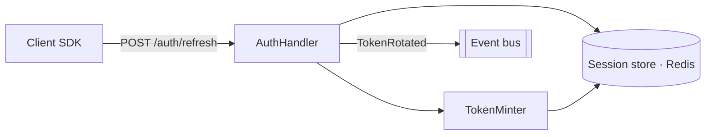
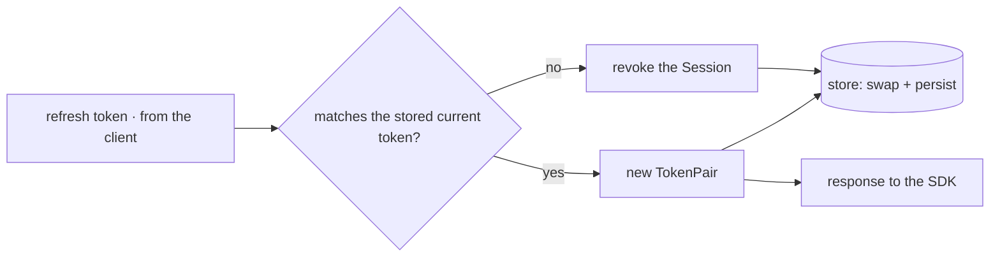
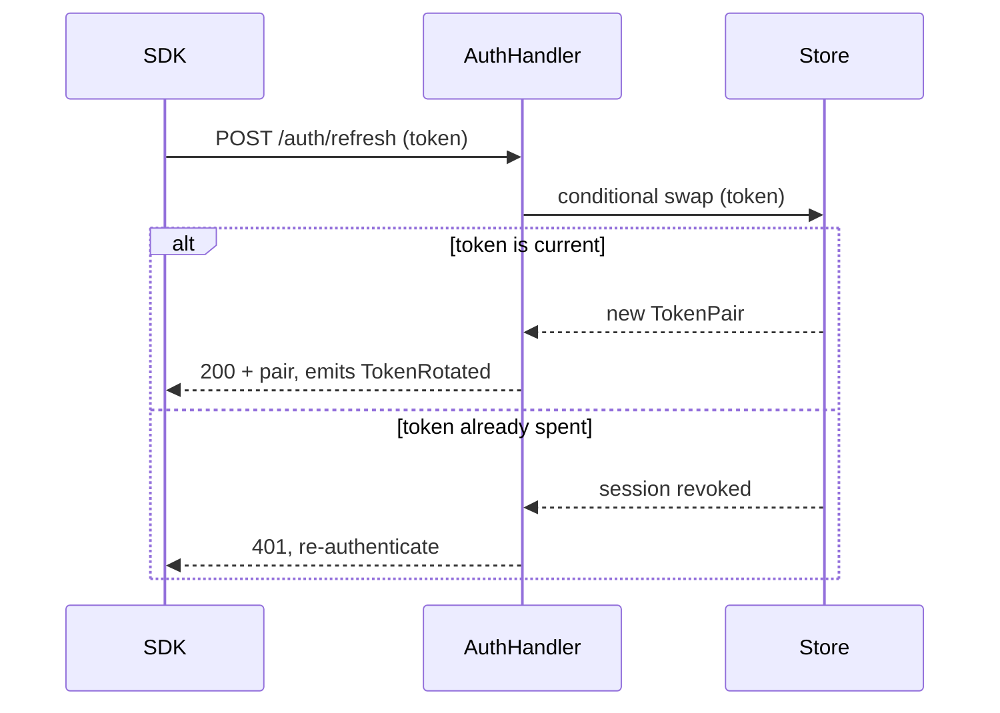

# Concepts

The high-level picture this spec changes: the components in play, where the data comes from and
lands, and the one flow the work touches. Read before `spec.md`; drawn with the `show-me` skill.

> A filled `<notes-dir>/CONCEPTS.md`. Copy the file, replace the content, delete the `>` lines.
> **Why it is not a spec section:** `spec.md` is budgeted at 200 lines and the diagrams are what the
> human reads *first* and re-reads while shaping the ledger. `spec.md` § Description mentions
> `@CONCEPTS.md` and draws nothing.
> **Draw with the `show-me` skill** — it picks the form (component tree, flow diagram, call tree,
> file tree) and mermaid is the form inside a `.md` file. A data flow between coarse components is
> the `dataflow` skill's job.
> **Written when the diagram shapes the TODOs.** The test is the ledger: a picture that changed a
> layer, a wave, or where a row splits earns its place. Work with no structure to draw has no
> `CONCEPTS.md`, and that is a legal state — never draw to fill the file.
> **Keep only the sections whose structure this work changes**, in this order. A change that adds no
> component drops § App architecture; one that moves no value drops § Data flow. All three sections
> empty means no file at all. The bold lead-in under each diagram is required — it is the sentence
> the diagram cannot say.
> The prose follows `harness-dev:text-style`.

## App architecture

**Unchanged:** the event bus, the SDK's transport, and every `/auth/*` route other than `refresh`.

> The components in play and how they connect — the ones this spec touches plus their immediate
> neighbours, never the whole system.
> One line naming **what does not move**. That is the half a reviewer needs to bound the blast
> radius, and the half prose always omits.

## Data flow

**Lifecycle of one refresh token:** minted at login → stored as the session's current token → spent
on one exchange → replaced by its successor, or, if presented twice, the trigger that revokes the
session.

> Where each value is born, what transforms it, and where it exits. Trace **the one value whose
> lifecycle this work changes** — here the refresh token, because rotation is what the ledger does to
> it. Its lifecycle goes in one line under the diagram; the flow falls out of the data
> (`ref-write.md` § Reading chain, step 3).

## The flow

**Trace:** a refresh request enters `AuthHandler`, swaps its token in the store, and leaves as a new
pair — or, on a replay, as a revoked session and a 401.

> Entry point to exit, for the one path this spec changes. Draw **the failure branch a TODO's
> `Done when` checks** — here the replay, because that is what TODO-1 proves; a failure no row tests
> is noise. The one-sentence trace under it is the same sentence `spec.md` § Goal carries: state it
> in one line or the flow was not understood.
