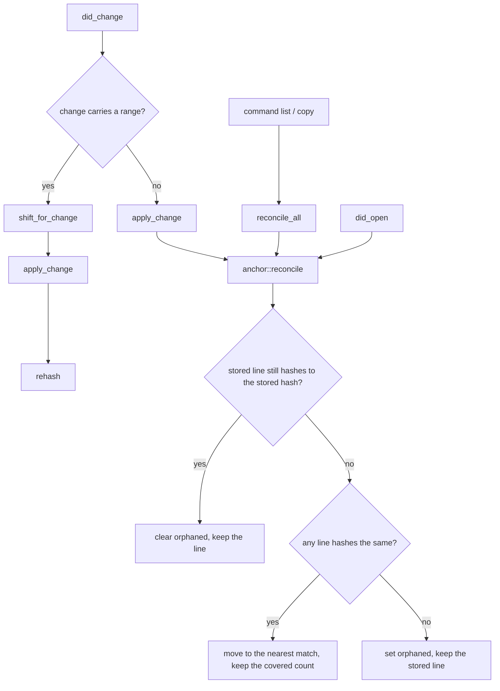

> A filled `$RESEARCH_DIR/<ep-slug>.md` — one entry point's research artifact. Copy the file, replace
> the content, delete the `>` lines; each one states the rules for the piece above it. The contract
> around the file — the 6-step chain and the cross-cutting rules — is `ref-artifact.md`.
> The `explorer` agent writes this shape; the `explore-critic` agent grades it.

# anchor::reconcile — where a stored comment lands when the file has changed

**Scope.** How a line comment keeps pointing at the line it was written on: the hash it stores, the
three re-anchoring paths (`did_open`, `did_change`, `reconcile_all`), and the orphan flag. **Out of
scope.** The LSP transport and the event loop (`main.rs`), the input-file hand-over that creates a
comment (`input.rs`), and the export format (`export.rs`) — none of them move an anchor.

**source list**:
dotfiles:25f27fa1

> Title, scope, and source-list criteria: `references/ref-artifact.md` § Result criteria and § Rules.

## Terms

| Term | Definition | Avoid | Source |
|---|---|---|---|
| anchor | The `(line, hash)` pair a comment stores, which is what lets it be found again after the file changes. | position, location | `harness/apps/line-comment/server/src/store.rs:27` |
| line hash | The first 16 hex characters of the SHA-256 of one line with trailing whitespace stripped. | fingerprint, digest | `harness/apps/line-comment/server/src/anchor.rs:8` |
| span | A comment that covers `line` through `end_line`; only its first line is hashed. | selection, block, range | `harness/apps/line-comment/server/src/store.rs:34` |
| orphaned | The state of a comment whose hash matches no line in the file; it keeps its stored line and is still shown. | lost, stale, dangling | `harness/apps/line-comment/server/src/store.rs:38` |
| store | One JSON file per workspace root holding every comment, keyed by repo-relative path. | database, index | `harness/apps/line-comment/server/src/store.rs:62` |

> The `## Terms` table is the raw material of `<notes-dir>/GLOSSARY.md`, so it is opinionated rather
> than a word list. Columns: | Term | Definition | Avoid | Source |.
> **Definition** — one or two sentences saying what the term *is*, never what it does or how it is
> built.
> **Avoid** — the other names the code uses for the same concept, comma-separated, `—` when the
> concept has only ever had one name.
> **Source** — the `path:line` where the term is declared or first carries this meaning.
> **One word per concept.** When the code names one thing three ways, pick the clearest and put the
> other two under Avoid.
> **Only words this project gives a specific meaning.** A general programming word — handler, config,
> retry, cache — earns a row only when the domain redefines it.
> **Every row cites a `path:line`.** A term with no source is a guess; drop it.
> **Definitions use the table's own terms.** Once a term has a row, use that word inside the other
> definitions rather than a synonym.

## Intent (tests)

| Test | What intent it pins | Source (file:line) |
|---|---|---|
| `editing_the_commented_line_keeps_the_comment_and_refreshes_the_hash` | An edit on the anchored line keeps the comment and re-hashes it, so the next reconcile still matches. | `harness/apps/line-comment/server/tests/session.rs:298` |
| `a_comment_below_an_edit_shifts_down` | An edit above the anchored line moves the anchor by the line delta without re-hashing it. | `harness/apps/line-comment/server/tests/session.rs:278` |
| `reopening_reanchors_a_moved_line_by_hash` | A file edited while closed re-anchors on open, by hash rather than by stored line. | `harness/apps/line-comment/server/tests/session.rs:336` |
| `reanchoring_picks_the_match_nearest_the_stored_line` | With several lines carrying the same hash, the one nearest the stored line wins. | `harness/apps/line-comment/server/tests/session.rs:348` |
| `a_lost_anchor_becomes_orphaned_and_is_still_shown` | A hash matching nothing sets `orphaned` and keeps the comment visible on its stored line. | `harness/apps/line-comment/server/tests/session.rs:361` |
| `a_recovered_anchor_clears_the_orphan_flag` | The orphan flag is derived on every reconcile, never sticky. | `harness/apps/line-comment/server/tests/session.rs:375` |
| `a_line_typed_inside_a_span_grows_it` | Both ends of a span shift, so a line inserted inside the span becomes part of it. | `harness/apps/line-comment/server/tests/session.rs:519` |
| `a_span_moves_whole_when_its_first_line_moves` | A span keeps the number of lines it covered wherever its hashed first line turns up. | `harness/apps/line-comment/server/tests/session.rs:537` |
| `copy_leaves_anchors_alone_when_the_file_cannot_be_read` | An unreadable file is not evidence its text is gone; anchors stay untouched. | `harness/apps/line-comment/server/tests/session.rs:795` |

> Columns: | Test | What intent it pins | Source (file:line) |. One row per test that exercises this path, and
> **What intent it pins** states the behaviour the code must keep, not what the test calls.
> With no test on the path, write `None — UNTESTED PATH` and carry it into § 6 as a refactor risk. An
> artifact with no test trail cannot claim it understood what the code is *for*.

## TL;DR

> The TL;DR is one Mermaid diagram of the path, before its tables.

## 1. Workflow steps

Incremental change (`did_change` with a range) — the common path:

| # | Step | File:line |
|---|---|---|
| 1 | Resolve the store key from the URI; a `.tmp/` path returns none and the change is dropped. | `harness/apps/line-comment/server/src/lib.rs:489` |
| 2 | Snapshot the file's comments, so the effects can be skipped when nothing moves. | `harness/apps/line-comment/server/src/lib.rs:492` |
| 3 | Shift every anchor across the change and collect the indices whose anchored line changed content. | `harness/apps/line-comment/server/src/anchor.rs:64` |
| 4 | Apply the change to the in-memory document text. | `harness/apps/line-comment/server/src/anchor.rs:45` |
| 5 | Clamp every anchor into the new text and re-hash the collected indices. | `harness/apps/line-comment/server/src/anchor.rs:118` |
| 6 | Sort the file's comments by line, then emit `PersistStore` + `PublishDiagnostics` only if the snapshot differs. | `harness/apps/line-comment/server/src/lib.rs:526` |

Full-text change and reopen (`did_change` with no range, `did_open`, `reconcile_all`):

| # | Step | File:line |
|---|---|---|
| 1 | Replace the whole document text. | `harness/apps/line-comment/server/src/anchor.rs:46` |
| 2 | Re-anchor every comment of the file by hash. | `harness/apps/line-comment/server/src/anchor.rs:139` |
| 3 | Sort by line and compare against the snapshot to decide the effects. | `harness/apps/line-comment/server/src/lib.rs:475` |

> Numbered table: | # | Step | File:line |. Give parallel paths their own labeled sub-tables.

## 2. Decision points

**DP-1 — does the change carry a range?**

- **Condition:** `change.range` is `Some(..)`, `harness/apps/line-comment/server/src/lib.rs:495`.
- **Branches:**

| Branch | Effect | File:line |
|---|---|---|
| `Some` — incremental | Shift, apply, re-hash. Anchors move by arithmetic; hashes are only recomputed for lines the change touched. | `harness/apps/line-comment/server/src/lib.rs:496` |
| `None` — full text | Apply, then reconcile by hash. Arithmetic is impossible, so every anchor is searched for. | `harness/apps/line-comment/server/src/lib.rs:514` |

**DP-2 — does the stored line still hash to the stored hash?**

- **Condition:** `line_hash(document[comment.line - 1]) == comment.hash`,
  `harness/apps/line-comment/server/src/anchor.rs:144`.
- **Branches:**

| Branch | Effect | File:line |
|---|---|---|
| matches | Clear `orphaned`, keep the line, search nothing. | `harness/apps/line-comment/server/src/anchor.rs:148` |
| no match | Search the whole document for the hash → DP-3. | `harness/apps/line-comment/server/src/anchor.rs:151` |

**DP-3 — did any line in the document hash the same?**

- **Condition:** the `min_by_key` over hash-equal lines yields an index,
  `harness/apps/line-comment/server/src/anchor.rs:155`.
- **Branches:**

| Branch | Effect | File:line |
|---|---|---|
| nearest match found | Move the comment there and keep the number of lines it covered. See EC-2. | `harness/apps/line-comment/server/src/anchor.rs:158` |
| no match anywhere | Set `orphaned`; the line is kept and the hint shows `💬?`. See EC-3. | `harness/apps/line-comment/server/src/anchor.rs:162` |

**DP-4 — can the file be read at all?**

- **Condition:** `current_text` finds an open buffer or reads the file from disk,
  `harness/apps/line-comment/server/src/lib.rs:415`.
- **Branches:**

| Branch | Effect | File:line |
|---|---|---|
| readable | Reconcile against that text. | `harness/apps/line-comment/server/src/lib.rs:441` |
| unreadable | Skip the file, leaving its anchors untouched. See EC-4. | `harness/apps/line-comment/server/src/lib.rs:437` |

> `DP-N` numbering and cross-reference rules: `references/ref-artifact.md` § Rules.

## 3. Identity / data carriers

| Layer | What carries identity | Equality | Mutated | Locked |
|---|---|---|---|---|
| store file map | the repo-relative path string | exact string, `\` normalised to `/` (`harness/apps/line-comment/server/src/lib.rs:459`) | the `Vec<Comment>` under the key | the key itself |
| one comment | `line` inside its file — `upsert` finds by `line` alone (`harness/apps/line-comment/server/src/store.rs:116`) | same `line` in the same file | `line`, `end_line`, `hash`, `orphaned` | `author` |
| re-anchoring | `hash` — the only field that survives an edit made while the file was closed | hash-equal lines are indistinguishable, which is what DP-3 breaks by distance | — | `hash`, until `rehash` recomputes it |
| span | the first line's hash; `end_line` is derived from the covered count | — | both ends, by `cover` (`harness/apps/line-comment/server/src/store.rs:50`) | the covered count, across a whole-span move |

> Identity/data-carrier criterion: `references/ref-artifact.md` § Result criteria.

## 4. Per-variant shapes

| Variant | Shape | Conflict key | Conflict resolution |
|---|---|---|---|
| single-line comment | `line`, `end_line` absent | `(file, line)` | `upsert` replaces the existing comment on that line (`harness/apps/line-comment/server/src/store.rs:116`) |
| span comment | `line` + `end_line`, first line hashed | `(file, line)` — the first line only | same `upsert`; a span and a single-line comment on the same first line collide and the later one wins |
| orphaned comment | `orphaned: true`, `line` kept as last known | `(file, line)` | none — it competes for the stored line with a live comment written there |

> Use this table when the path handles multiple shapes of one thing.

## 5. Edge cases

| # | Case | Effect | Source (file:line) |
|---|---|---|---|
| EC-1 | The document holds several identical lines (`}`, a blank line, a repeated `return nil`). | The comment jumps to whichever of them is nearest the stored line, which may not be the one it was written on. | `harness/apps/line-comment/server/src/anchor.rs:151` |
| EC-2 | A span's first line moves and its body shrinks. | The span keeps its old covered count, so it can now cover lines that were never selected. | `harness/apps/line-comment/server/src/anchor.rs:159` |
| EC-3 | The anchored line is deleted outright. | `orphaned` is set, the stored line is kept, and the hint renders `💬?` with `(orphaned)` appended. | `harness/apps/line-comment/server/src/lib.rs:604` |
| EC-4 | The file is renamed or deleted while the editor is closed. | `reconcile_all` skips it; the comments stay under the old key forever, with no path that removes them. | `harness/apps/line-comment/server/src/lib.rs:437` |
| EC-5 | A change swallows the whole span. | Both ends collapse onto the line the change starts at. | `harness/apps/line-comment/server/src/anchor.rs:96` |
| EC-6 | An anchor points past the end of the shortened document. | `rehash` clamps every line into `1..=len`, so two comments can end up on the same last line. | `harness/apps/line-comment/server/src/anchor.rs:122` |
| EC-7 | The line differs only in trailing whitespace. | The hash strips trailing whitespace, so the anchor still matches and no re-hash is needed. | `harness/apps/line-comment/server/src/anchor.rs:9` |
| EC-8 | The store file exists but cannot be parsed. | The session starts with an empty store and shows an error; the next `PersistStore` overwrites the unreadable file. | `harness/apps/line-comment/server/src/lib.rs:95` |

> `EC-N` rules and failure-path criterion: `references/ref-artifact.md`.

## 6. Refactor risks (hotspots)

| Hotspot | Why it bites |
|---|---|
| `anchor::reconcile` nearest-match search | Hash collisions are ordinary in source code, not rare. Any change to the distance rule silently re-points existing comments, and no test pins which line wins beyond the two nearest. |
| The three re-anchoring paths | `did_open`, `did_change`, and `reconcile_all` each re-implement snapshot → mutate → sort → compare. A rule added to one is silently missing from the other two. |
| `upsert` keyed on `line` alone | A span and a single-line comment sharing a first line overwrite each other with no warning, and the caller cannot tell an insert from a replace. |
| `Store::load` swallowing every read error | `fs::read_to_string` failing for any reason returns an empty store (`harness/apps/line-comment/server/src/store.rs:87`), and the next save replaces the real file. A permission error is indistinguishable from a first run. |
| The store key is a path string | A rename leaves comments under a key nothing reads and nothing cleans up. |

> Each hotspot states the concrete failure a future change could cause.

## 7. File map

| File | Role |
|---|---|
| `harness/apps/line-comment/server/src/anchor.rs` | Hashing, position arithmetic, shifting, and the reconcile search. The whole anchoring policy. |
| `harness/apps/line-comment/server/src/store.rs` | The `Comment` shape, span arithmetic (`cover`, `last_line`, `covers`), and load/save of the JSON store. |
| `harness/apps/line-comment/server/src/lib.rs` | The session: the three re-anchoring call sites, the effect list each emits, and the inlay-hint rendering that shows the orphan mark. |
| `harness/apps/line-comment/server/tests/session.rs` | Every behaviour above, driven through `Session` with no transport. |

> Table: | File | Role |. Include every referenced file and state its role.

## Grill answers

1. **Which tests exercise this path, and what intent does each pin?** The nine rows of § Intent. All
   of them drive `Session` directly; no test reaches the anchoring code through the LSP transport.
2. **Is any part of the path UNTESTED?** Yes — EC-6 (two anchors clamped onto the same last line) and
   EC-8 (an unparseable store overwritten by the next save) have no test.
3. **What are the ordered atomic steps from entry to exit?** § 1, one sub-table per path.
4. **What does every branch check?** DP-1 through DP-4, each with its predicate and `path:line`.
5. **What carries identity at each layer?** § 3 — the path string, then `line` within the file, then
   `hash` across an edit made while closed.
6. **Which fields are locked after creation?** `author` only. `line`, `end_line`, `hash`, and
   `orphaned` are all recomputed on every reconcile.
7. **What would a new contributor most likely get wrong?** That `orphaned` is derived rather than
   stored state. It is written to the JSON store, which makes it look sticky, and every reconcile
   overwrites it.

> Answer the agenda in order. A section reference avoids duplicating an answer.

## Trace

`did_change` shifts every stored anchor of the file across the incremental change, applies the change
to the document text, and re-hashes the anchors whose line content moved — branching on whether the
change carries a range, and falling back to a whole-document hash search that either moves the
comment to the nearest hash-equal line or marks it orphaned.

> One-sentence trace criterion: `references/ref-artifact.md` § Result criteria.
